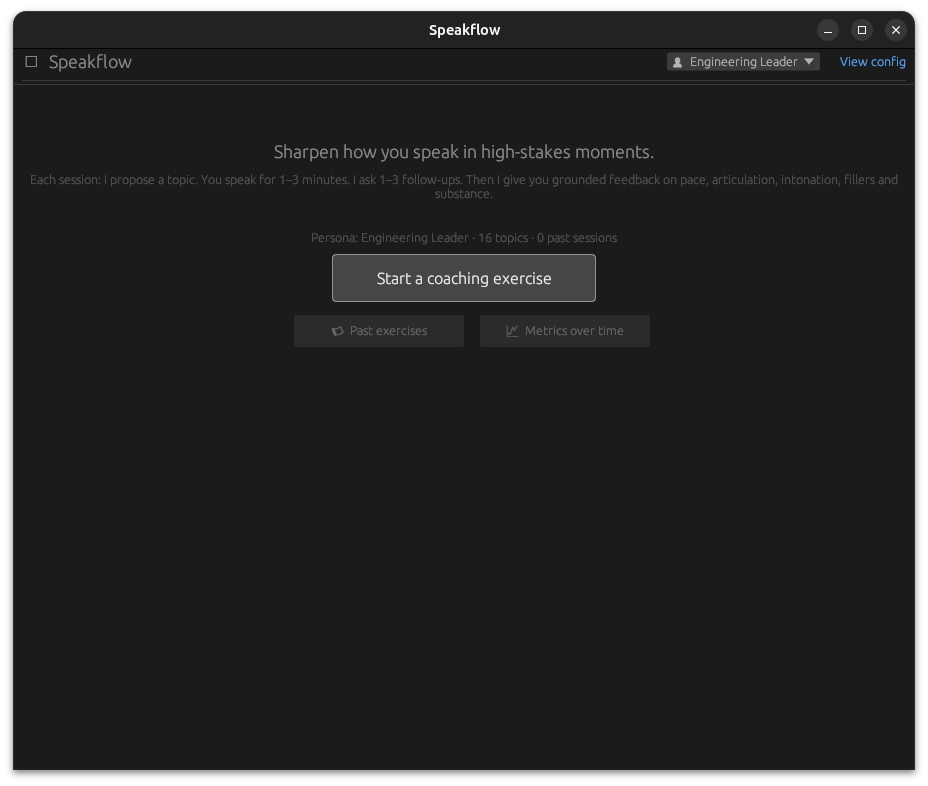

# Speakflow

A local-first speaking coach for senior engineering leaders. Runs entirely on
your machine — no audio or transcripts leave the box.

- **UI:** egui (pure Rust, native on macOS / Linux / Windows) — charts via `egui_plot`
- **Speech recognition:** whisper.cpp via `whisper-cli` (local, bundled at runtime)
- **Speech synthesis (optional):** [Sherpa-ONNX](https://github.com/k2-fsa/sherpa-onnx) running the Kokoro TTS model — for reading prompts and follow-up questions aloud
- **Coach reasoning:** [Ollama](https://ollama.com) running locally (default model `llama3.1:8b`)
- **Audio I/O:** `cpal` for capture, `rodio` for playback (CoreAudio / WASAPI / ALSA)
- **History:** append-only JSON-lines log on disk; trends rendered with `egui_plot`



## Session flow

1. **Welcome screen** — single button: *Start a coaching exercise*.
2. **Theme proposal** — the model picks one of 16 leadership / engineering /
   strategy buckets and proposes a concrete 1–3-minute speaking prompt.
3. **Confirm ready** — you see the theme + prompt and click *I'm ready*.
4. **Recording** — live timer + VU meter. Auto-stops at 3:00, manual stop
   allowed after 1:00.
5. **Local transcription** — whisper.cpp runs on the captured audio.
6. **Follow-up questions** — the model reads your transcript and asks 1–3
   probing questions an exec or board member might ask.
7. **Recording the follow-ups** — same recorder, capped at 1:30 each.
8. **Structured feedback** — overall impression, pace & rhythm, articulation
   & clarity, intonation & energy, filler words, executive substance, and one
   concrete drill for next time. The LLM is fed *measured* delivery metrics
   (wpm, pause counts, energy variation, filler counts) so it reasons about
   your actual delivery, not what it thinks you sound like.
9. **Auto-saved to history** — when the feedback finishes, the session
   (theme, transcript, follow-ups, metrics, feedback text) is appended to a
   local log so it shows up in the **Past exercises** and **Metrics over
   time** views.

## Past exercises & trends

From the welcome screen (or the post-feedback screen):

- **📜 Past exercises** — split-pane browser. Newest sessions on the left,
  full feedback / metrics / transcript / follow-ups for the selected one on
  the right.
- **📈 Metrics over time** — six independent line+dot charts: pace (wpm),
  fillers, long pauses, pause time, energy CV, and total words. X-axis is the
  session ordinal, so spacing stays uniform whether you do one a day or ten.

Sessions live in an append-only `history.jsonl` file under the platform data
dir:

| Platform | Path |
|---|---|
| Windows | `%APPDATA%\speakflow\history.jsonl` |
| macOS   | `~/Library/Application Support/speakflow/history.jsonl` |
| Linux   | `~/.local/share/speakflow/history.jsonl` |

The Trends view shows the exact path under "Where is this stored?". Delete
the file to reset trends; the format is human-readable so you can also edit
or grep it directly.

## Prerequisites

### 1. Rust toolchain
```bash
curl --proto '=https' --tlsv1.2 -sSf https://sh.rustup.rs | sh
```

(Windows: use https://www.rust-lang.org/tools/install — also install the
"C++ build tools" prompt it shows you, needed only for the linker.)

### 2. Ollama + a model
```bash
# https://ollama.com — install for your platform, then:
ollama pull llama3.1:8b
ollama serve     # usually started by the installer already
```

### 3. whisper-cli (prebuilt binary, no compilation)

We shell out to whisper.cpp's `whisper-cli` rather than linking against it,
which avoids any C/C++ build dependencies entirely.

**Windows:**
1. Go to https://github.com/ggerganov/whisper.cpp/releases
2. Download the latest `whisper-bin-x64.zip`
3. Extract to e.g. `C:\tools\whisper\`
4. Either add that folder to PATH, or set `WHISPER_BIN`:
   ```powershell
   [Environment]::SetEnvironmentVariable("WHISPER_BIN", "C:\tools\whisper\whisper-cli.exe", "User")
   ```
   (Older releases name the binary `main.exe` — the app accepts either.)

**macOS:**
```bash
brew install whisper-cpp     # provides `whisper-cli` on PATH
```

**Linux:**
```bash
# Either build from source:
git clone https://github.com/ggerganov/whisper.cpp && cd whisper.cpp && make
# then put ./build/bin/whisper-cli on your PATH or set WHISPER_BIN.
```

### 4. Whisper model (one-time, ~150 MB)

**Windows (PowerShell):**
```powershell
$dir = "$env:APPDATA\speakflow\models"
New-Item -ItemType Directory -Force -Path $dir | Out-Null
Invoke-WebRequest -Uri "https://huggingface.co/ggerganov/whisper.cpp/resolve/main/ggml-base.en.bin" `
                  -OutFile "$dir\ggml-base.en.bin"
```

**macOS / Linux:**
```bash
mkdir -p ~/.config/speakflow/models
curl -L -o ~/.config/speakflow/models/ggml-base.en.bin \
  https://huggingface.co/ggerganov/whisper.cpp/resolve/main/ggml-base.en.bin
```

For better accuracy on a fast machine, swap in `ggml-small.en.bin` or
`ggml-medium.en.bin` from the same repository, and set `WHISPER_MODEL`
to its path.

### 5. Sherpa-ONNX + Kokoro voice model (optional — for spoken prompts)

The app reads each speaking prompt and follow-up question aloud while still
showing the text. If Sherpa-ONNX isn't installed it stays text-only — nothing
else changes. We use a prebuilt binary (no compilation) and the same Kokoro
model that gives state-of-the-art quality at small-model footprint.

**Windows:**
1. Download a prebuilt `sherpa-onnx-vX.Y.Z-win-x64.tar.bz2` from
   https://github.com/k2-fsa/sherpa-onnx/releases (any recent release).
2. Extract it. The folder contains `sherpa-onnx-offline-tts.exe`.
3. Either add that folder to PATH, or set `SHERPA_BIN`:
   ```powershell
   [Environment]::SetEnvironmentVariable("SHERPA_BIN", "C:\tools\sherpa-onnx\sherpa-onnx-offline-tts.exe", "User")
   ```
4. Download the Kokoro English model bundle (~325 MB):
   https://github.com/k2-fsa/sherpa-onnx/releases/download/tts-models/kokoro-en-v0_19.tar.bz2
5. Extract the archive into the app's models dir so it sits next to the
   whisper model:
   ```powershell
   $dir = "$env:APPDATA\speakflow\models"
   # Result should be: $dir\kokoro-en-v0_19\{model.onnx, voices.bin, tokens.txt, espeak-ng-data\}
   ```
   Or set `KOKORO_MODEL_DIR` to wherever you extracted it.
6. Pick a voice per persona in the **Personas** editor. For `kokoro-en-v0_19`
   the IDs map to: `af` (0), `af_bella` (1), `af_nicole` (2), `af_sarah` (3),
   `af_sky` (4), `am_adam` (5), `am_michael` (6), `bf_emma` (7),
   `bf_isabella` (8), `bm_george` (9), `bm_lewis` (10). Default is 0.

**macOS / Linux:** download the matching prebuilt from the same Sherpa-ONNX
releases page, then follow steps 3–6 with the appropriate paths.

The app invokes:
```
sherpa-onnx-offline-tts \
  --kokoro-model=<dir>/model.onnx \
  --kokoro-voices=<dir>/voices.bin \
  --kokoro-tokens=<dir>/tokens.txt \
  --kokoro-data-dir=<dir>/espeak-ng-data \
  --num-threads=N --sid=<id> --output-filename=<tmp.wav> "<text>"
```

## Running

```bash
cargo run --release
```

Useful environment variables:

- `OLLAMA_MODEL` — override default model (e.g. `qwen2.5:14b`).
- `OLLAMA_HOST` — default `http://localhost:11434`.
- `WHISPER_BIN` — full path to `whisper-cli.exe` / `whisper-cli` if it's not on PATH.
- `WHISPER_MODEL` — path to a `.bin` whisper model.
- `SHERPA_BIN` — full path to `sherpa-onnx-offline-tts(.exe)` (optional; disables spoken prompts when unset).
- `KOKORO_MODEL_DIR` — folder containing `model.onnx`, `voices.bin`, `tokens.txt`, and `espeak-ng-data/`. Defaults to `%APPDATA%\speakflow\models\kokoro-en-v0_19`.
- Voice is set per-persona in the **Personas** editor (not via env var).
- `RUST_LOG=debug` — verbose logging.

## Architecture

```
main.rs            spawns a tokio runtime, hands handle to the eframe app
src/app.rs         egui app + state machine (Welcome → … → Feedback / History / Trends)
src/audio.rs       cpal capture → mono → 16 kHz f32 (linear resample on the cb)
src/stt.rs         shells out to whisper-cli, writes/reads temp WAV
src/tts.rs         shells out to sherpa-onnx-offline-tts (Kokoro), plays the WAV through rodio
src/llm.rs         Ollama /api/chat streaming client
src/coach.rs       prompt templates: theme, follow-ups, structured feedback
src/analysis.rs    pace, pause structure, energy CV, filler-word counts
src/history.rs     append-only JSONL persistence of completed sessions
```

Long-running work (LLM streaming, whisper inference) runs on the tokio
runtime. The UI thread polls mpsc channels each frame and asks egui to
repaint when new text streams in.

## Privacy

Everything is local: no audio, no transcript, no feedback, and no history
ever leaves the machine. The only network call is to `localhost:11434`
(Ollama). The history file is plain JSON-lines under your user profile —
you own it.

## Caveats / known limits

- Pure-Rust linear resampling is good enough for STT. For higher fidelity
  swap to `rubato`.
- Filler-word detection uses a static English list. Multilingual support
  would require swapping the whisper model and the filler list.
- Energy coefficient of variation is a coarse proxy for intonation; pitch
  tracking (e.g. with `pitch-detection`) would be more direct.
- This crate has not been compiled in the environment where it was authored.
  If you hit a minor API mismatch with egui 0.29 (e.g. `output_mut` vs
  `copy_text`), it's a one-line tweak in `src/app.rs`.
